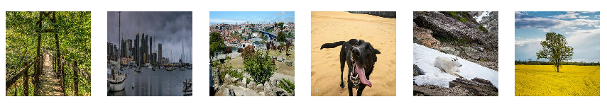
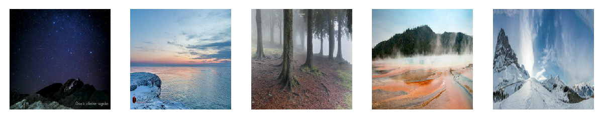

# Generating-art-from-photographs

Implementation of [CycleGAN](https://arxiv.org/abs/1703.10593) in PyTorch and trained on [Monet-Photo](https://www.kaggle.com/c/gan-getting-started/data) dataset

## CycleGAN
CycleGAN imposes a constraint that the model should be **cycle consistent**. If G : X -> Y transforms an image from domain X to target (Y) distribution 
and F : Y -> X transforms an image from domain Y to target (X) distribution, then cycle consistency constraint ensures that the reconstruction error is minimized
i.e **F(G(x)) ~ x**.

We also want the color distribution to be preserved, so we also impose an **identity loss**. It says that the functions G and F must be able to represent the
**Identity function**. So **G(y) ~ y** which ensures that the colors are not drastically changed when not necessary.

### Key elements of the model
 - Instance Normalization
 - Residual Blocks

## Some Training images
**Photo images**

**Monet images**

## Visualizing Training stages

                                                   Original Input Monet Images

                                                   Original Input Photographs

                                                         Epoch 0 Predicted photos

                                                        Epoch 0 Reconstructed monets
                                                               

                                                         Epoch 0 Predicted monets

                                                        Epoch 0 Reconstructed photos

                                                         Epoch 50 Predicted photos

                                                        Epoch 50 Reconstructed monets
                                                               

                                                         Epoch 50 Predicted monets

                                                        Epoch 50 Reconstructed photos

                                                         Epoch 100 Predicted photos

                                                        Epoch 100 Reconstructed monets
                                                               

                                                         Epoch 100 Predicted monets

                                                        Epoch 100 Reconstructed photos

